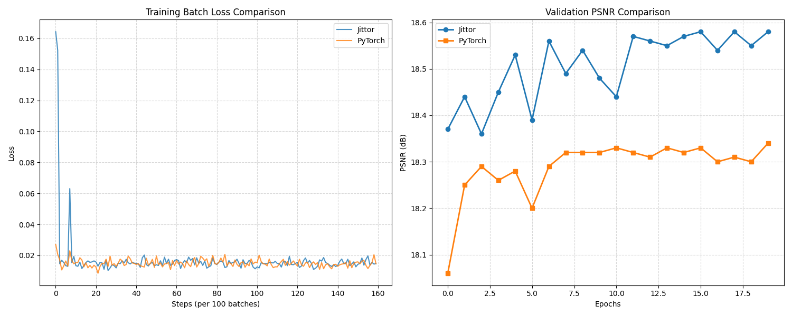
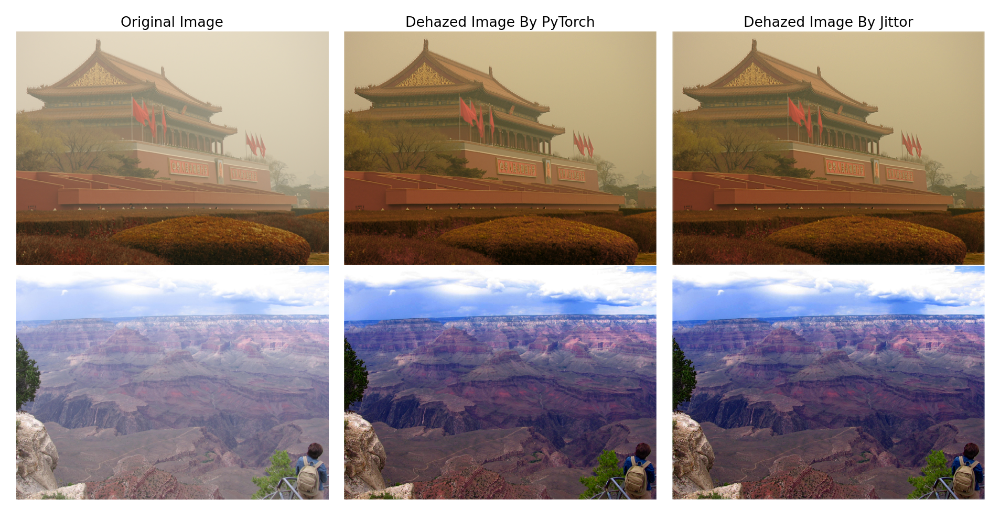
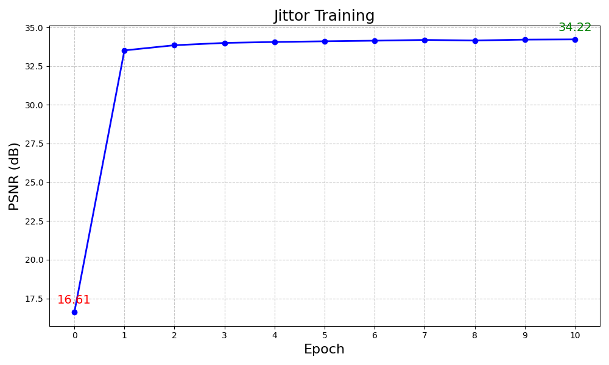
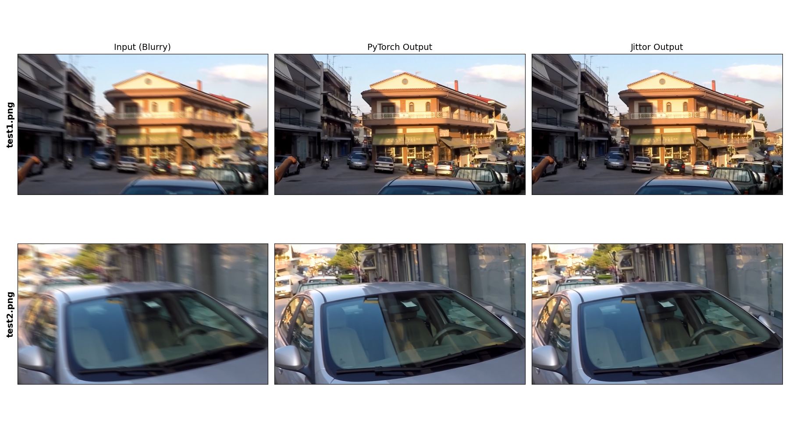

# NKU Sprout 

## 项目概述

本项目为南开大学“新芽计划”大作业。针对**恶劣环境下的视觉感知**选题，基于 **Jittor** 深度学习框架，复现了两类经典图像增强模型。


| 模型 | 感知任务 | 角色定位 | 论文 |
| :--- | :--- | :--- | :--- |
| **AOD-Net** | 图像去雾 | 针对雾天的端到端感知优化 | [ICCV 2017](https://openaccess.thecvf.com/content_ICCV_2017/papers/Li_AOD-Net_All-In-One_Dehazing_ICCV_2017_paper.pdf) |
| **NAFNet** | 通用复原 | 处理运动模糊与复杂噪声的通用架构 | [ECCV 2022](https://www.ecva.net/papers/eccv_2022/papers_ECCV/papers/136670017.pdf)|


## 快速开始

### 环境配置

```bash
pip install -r requirements.txt
```


### 克隆项目

```bash
git clone https://github.com/BLH549/NKU_Sprout.git
cd NKU_Sprout
```

## 项目结构

```
NKU_Sprout/
├── GoPro.md                          # GoPro 数据集说明
├── README.md                          # 本文件
├── requirements.txt                   # 依赖列表
├── fig/                               # 训练/可视化对比图
└── dl_sprout/
    ├── AODNet_jittor/
    │   ├── jt_model.py               # AOD-Net Jittor 模型定义
    │   ├── jt_data.py                # 数据加载模块
    │   ├── jt_train.py               # 训练脚本
    │   ├── jt_inference.py           # 推理脚本
    │   ├── VisualComparison.py       # 可视化对比
    │   ├── model.py                  # PyTorch 原始模型
    │   ├── output_results/           # 推理输出
    │   ├── saved_models/             # 预训练模型目录
    │   │   ├── AODNet_jt_best.pth
    │   │   └── dehaze_net_epoch_17_jt.pth
    │   └── test_images/              # 测试图像
    │
    └── NAFNet_jittor/
        ├── model.py                  # NAFNet Jittor 模型定义
        ├── dataset.py                # 数据加载模块
        ├── train.py                  # 训练脚本
        ├── inference.py              # 推理脚本
        ├── calc_psnr.py              # PSNR 计算工具
        ├── ConvertTojittor.py        # 权重转换工具
        ├── VisualComparison.py       # 可视化对比工具
        ├── torch_model.py            # PyTorch 原始模型
        ├── saved_models/             # 预训练模型目录
        │   └── NAFNet-GoPro-width32.pth
        ├── test_img/                 # 测试图像
        └── training_results/         # 训练结果
    └── log/                           # 训练日志
        ├── AODNet/
        └── NAFNet/
```

## 实验验证与可视化
### AOD-Net 训练说明

训练策略：本项目在论文数据集上完成了 AOD-Net 从零开始的完整训练。

* **对齐表现**：Loss 曲线收敛特征及验证集指标（PSNR）与原论文实现高度一致。
* **感知增强**：有效消除了图像中的雾气干扰，显著提升了场景边缘与纹理特征的清晰度。


### AOD-Net 训练对比图：




### AODNet 复现可视化对比图：



### NAFNet 训练说明

由于 NAFNet 从头进行全量训练对计算资源要求较高，本项目通过 “扰动-收敛（Perturbation-Convergence）” 实验验证 Jittor 框架下模型实现与训练流程的正确性。

* **实验设计**：
  1. 初始化：加载原版预训练权重。
  2. 扰动：对模型权重施加高斯噪声，使 PSNR 出现大幅度人为下降。
  3. 恢复训练：使用本项目实现的 train.py 脚本进行少量Epochs的微调。


* **验证结论**：实验显示模型在 1-2 Epoch 内迅速恢复至原始性能水平。这有力证明了本项目在 **模型实现、数据处理流水线及反向传播逻辑** 上的准确性。


### NAFNet 训练日志可视化：


### NAFNet 复现可视化对比图：

##  模型推理

### AOD-Net 推理

```bash
cd dl_sprout/AODNet_jittor
python jt_inference.py 

```

### AOD-Net 可视化对比
```bash
cd dl_sprout/AODNet_jittor
python VisualComparison.py 
```


### NAFNet 推理

```bash
cd dl_sprout/NAFNet_jittor
python inference.py
```

### NAFNet可视化对比
```bash
cd dl_sprout/NAFNet_jittor
python VisualComparison.py 
```


---

## 训练数据准备

### AOD-Net 数据集

链接：[作者项目主页](https://sites.google.com/site/boyilics/website-builder/project-page)

#### 数据集目录结构

```
data/
├── original_images/
│   ├── NYU2_1.jpg
│   ├── NYU2_2.jpg
│   └── ...
└── hazy_images/
    ├── NYU2_1_1_1.jpg
    ├── NYU2_1_1_2.jpg
    └── ...
```


### NAFNet 数据集

使用的是原论文中的GoPro数据集。(可以按照原论文中[GoPro.md](./GoPro.md) 的说明准备)

训练集 ：
[Google Drive](https://drive.google.com/file/d/1zgALzrLCC_tcXKu_iHQTHukKUVT1aodI/) |
[百度网盘](https://pan.baidu.com/s/1fdsn-M5JhxCL7oThEgt1Sw?pwd=9d26)

测试集:：
[Google Drive](https://drive.google.com/file/d/1abXSfeRGrzj2mQ2n2vIBHtObU6vXvr7C/) |
[百度网盘](https://pan.baidu.com/s/1oZtEtYB7-2p3fCIspky_mw?pwd=rmv9)

#### 数据集目录结构

```
datasets/GoPro/
├── train/
│   ├── input/        # 模糊图像
│   │   ├── GOPR0372_07_00-000047.png
│   │   └── ...
│   └── target/       # 清晰图像
│       ├── GOPR0372_07_00-000047.png
│       └── ...
└── test/
    ├── input.lmdb    # 测试输入 (LMDB 格式)
    └── target.lmdb   # 测试目标 (LMDB 格式)
```

---

##  模型训练

### AOD-Net 训练

```bash
cd dl_sprout/AODNet_jittor

python jt_train.py 
```


### NAFNet 训练

```bash
cd dl_sprout/NAFNet_jittor

python train.py 
```


